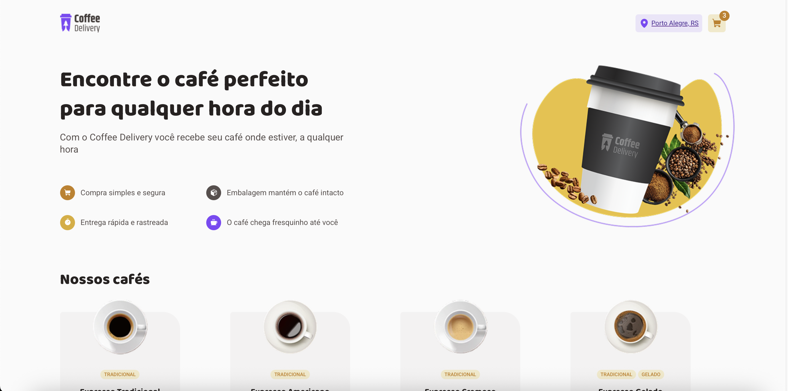
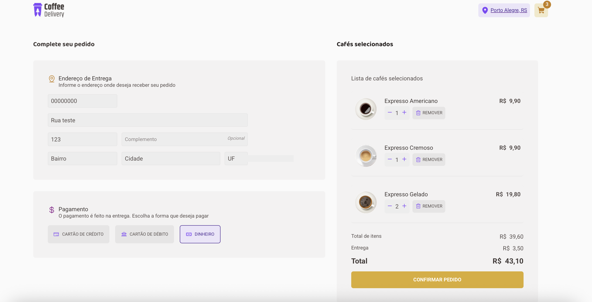
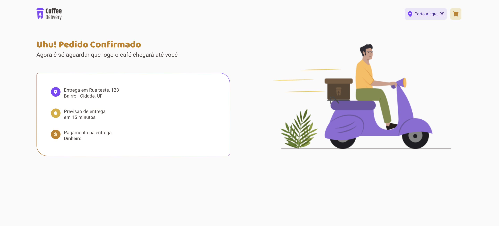
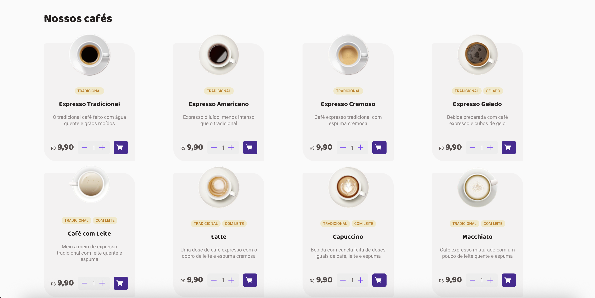

# ☕ Coffee Delivery

Aplicação web responsiva para pedidos de café online, desenvolvida como desafio da [Rocketseat](https://www.notion.so/Desafio-02-Coffee-Delivery-30e42a21fdb44b09a85244fc2c3dbdf9) na trilha de ReactJS da formação Ignite. O sistema permite que usuários selecionem cafés, preencham o endereço de entrega e escolham a forma de pagamento.

## 🚀 Tecnologias utilizadas

* **React**
* **TypeScript**
* **Vite**
* **React Router DOM**
* **Styled-components**
* **Phosphor-react (ícones)**

## 📦 Funcionalidades

* Listagem de cafés com descrição e valor unitário
* Adição e remoção de cafés no carrinho
* Cálculo automático de valor total e frete
* Formulário com validação de endereço
* Seleção da forma de pagamento (crédito, débito, dinheiro)
* Confirmação de pedido com resumo dos dados
* Interface responsiva e intuitiva

## 🧪 Como executar

```bash
# Clone o repositório
git clone https://github.com/SEU_USUARIO/coffee-delivery.git

# Acesse a pasta do projeto
cd coffee-delivery

# Instale as dependências
npm install

# Inicie o projeto
npm run dev
```

## 🖼️ Demonstração

### 🏠 Página inicial



### 🛒 Checkout



### ✅ Confirmação de Pedido



### 📋 Lista de produtos



## 📚 Desafio proposto

Este projeto foi baseado nas instruções do Desafio 02 - Coffee Delivery da Rocketseat, cujo objetivo era aplicar na prática os conceitos de:

* Gerenciamento de estado local com React
* Criação de formulários com validação
* Navegação entre rotas
* Boas práticas com TypeScript
* Estilização de componentes com styled-components

## 💡 Aprendizados

Durante o desenvolvimento, aprofundei meus conhecimentos em:

* Gerenciamento de estados complexos em formulários
* Validação usando `zod` em conjunto com `react-hook-form`
* Estruturação de componentes reutilizáveis e responsivos
* Controle de navegação com `react-router-dom`

## 📌 Status do projeto

✔️ Finalizado
🚧 Possíveis melhorias futuras:

* Integração com API real de pagamentos e entregas
* Suporte a múltiplos idiomas

